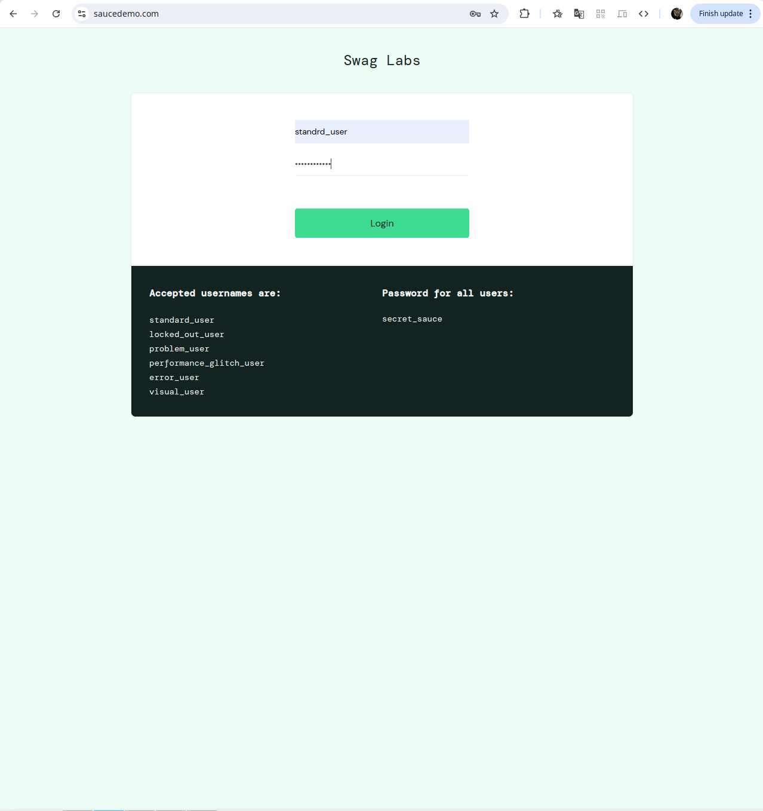
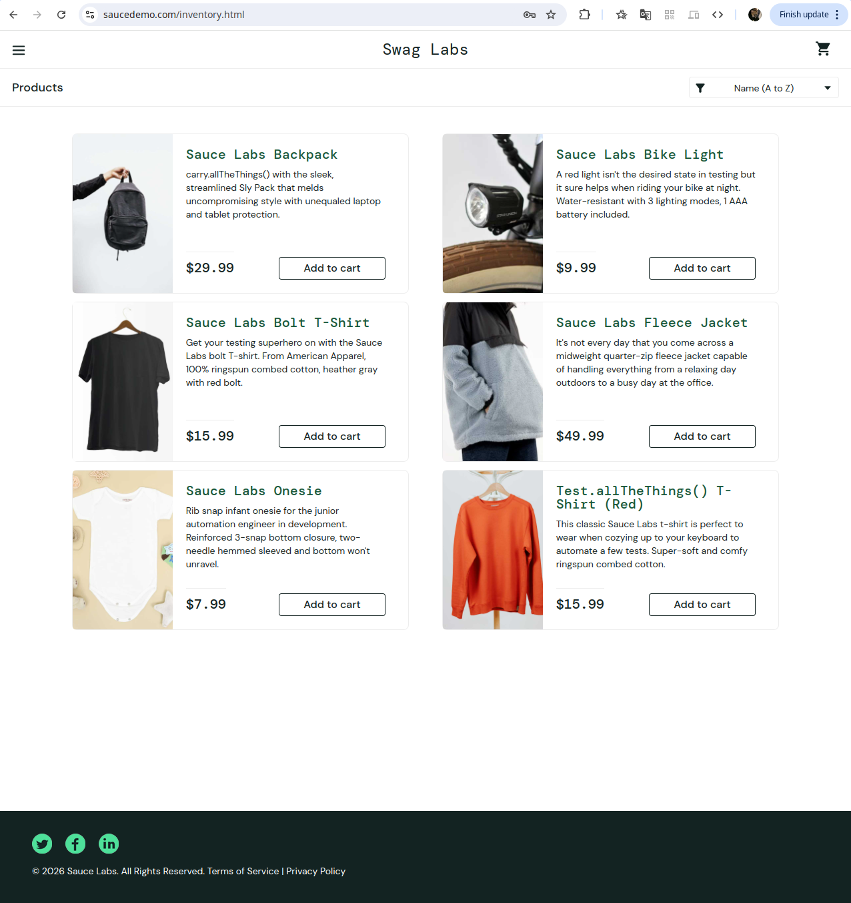
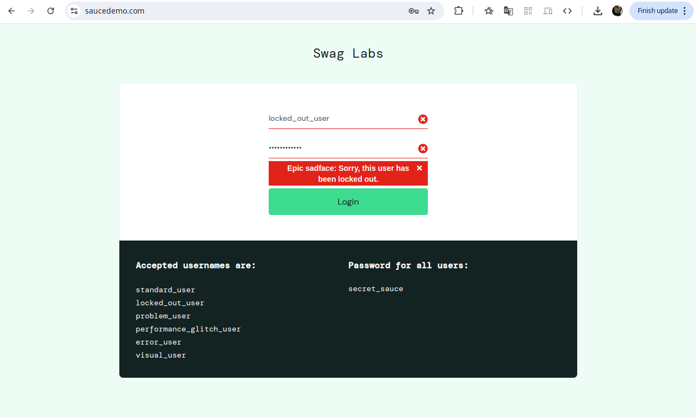
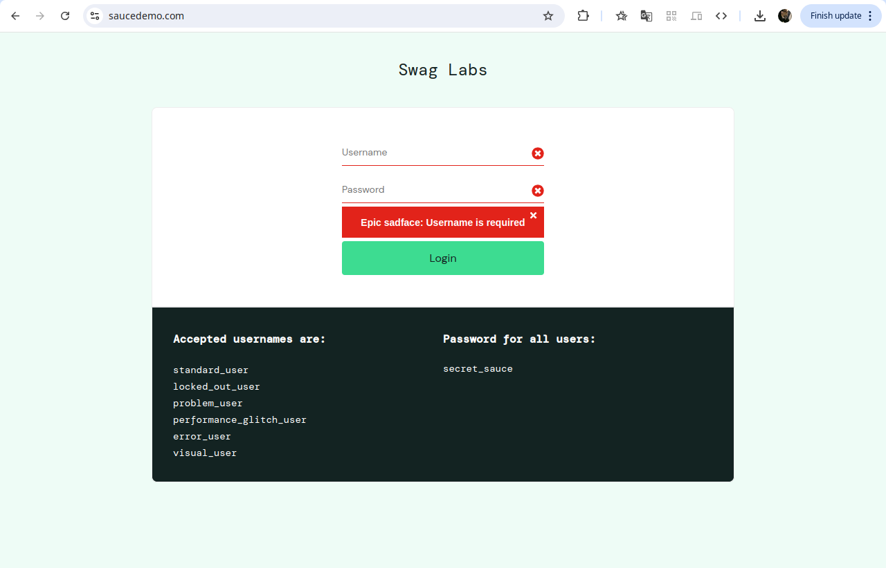
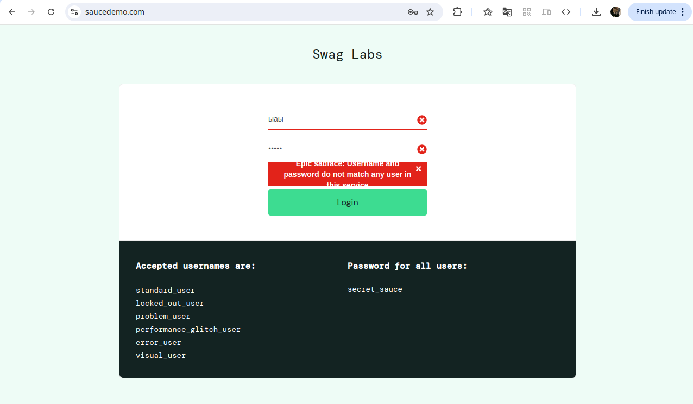

# Отчет о тестировании сайта Saucedemo

**Сайт:** [https://www.saucedemo.com/](https://www.saucedemo.com/)
**Тестировщик:** vriesale

---

## Тест-кейс №1: Позитивная авторизация (Valid Login)

| Параметр | Описание |
| :--- | :--- |
| **ID** | TC-01 |
| **Название** | Успешный вход в систему с валидными данными |
| **Приоритет** | High |
| **Предусловия** | Открыта главная страница [saucedemo.com](https://www.saucedemo.com/) |

### Шаги воспроизведения:
1. Ввести в поле "Username" значение `standard_user`.
2. Ввести в поле "Password" значение `secret_sauce`.
3. Нажать кнопку "Login".

### Ожидаемый результат:
* Пользователь успешно авторизован и перенаправлен на страницу `/inventory.html`.
* В хедере отображается заголовок "Products".
* В верхнем правом углу отображается иконка корзины.

---

## Тест-кейс №2: Негативная авторизация (Locked Out User)

| Параметр | Описание |
| :--- | :--- |
| **ID** | TC-02 |
| **Название** | Попытка входа заблокированным пользователем |
| **Приоритет** | Medium |
| **Предусловия** | Открыта главная страница [saucedemo.com](https://www.saucedemo.com/) |

### Шаги воспроизведения:
1. Ввести в поле "Username" значение `locked_out_user`.
2. Ввести в поле "Password" значение `secret_sauce`.
3. Нажать кнопку "Login".

### Ожидаемый результат:
* Авторизация не происходит, пользователь остается на странице логина.
* Поля ввода подсвечиваются красным цветом (UI индикация ошибки).
* Появляется сообщение об ошибке: `Epic sadface: Sorry, this user has been locked out.`.
* Кнопка закрытия ошибки (X) активна и убирает сообщение при нажатии.

---

## Тест-кейс №3: Негативная проверка UI (Empty Fields)

| Параметр | Описание |
| :--- | :--- |
| **ID** | TC-03 |
| **Название** | Валидация пустых полей ввода |
| **Приоритет** | Low |

### Шаги воспроизведения:
1. Оставить поле "Username" пустым.
2. Оставить поле "Password" пустым.
3. Нажать кнопку "Login".

### Ожидаемый результат:
* Форма не отправляется.
* Появляется сообщение об ошибке: `Epic sadface: Username is required`.
* Иконка знака (х) отображаются внутри обоих пустых полей.

---

## Тест-кейс №4: Негативная проверка UI (Incorrect data)

| Параметр | Описание |
| :--- | :--- |
| **ID** | TC-04 |
| **Название** |Валидация не верных данных |
| **Приоритет** | Low |

### Шаги воспроизведения:
1. Ввести не коректные данные в поле "Username".
2. Ввести не коректные данные в поле "Password".
3. Нажать кнопку "Login".

### Ожидаемый результат:
* Форма не отправляется.
* Появляется сообщение об ошибке: `Epic sadface: Username and password do not match any user in this service`.
* Текст об ошибке выходит за рамки обозначеного красного прямоугольника.
* Кнопка закрытия ошибки (X) активна и убирает сообщение при нажатии.

---
