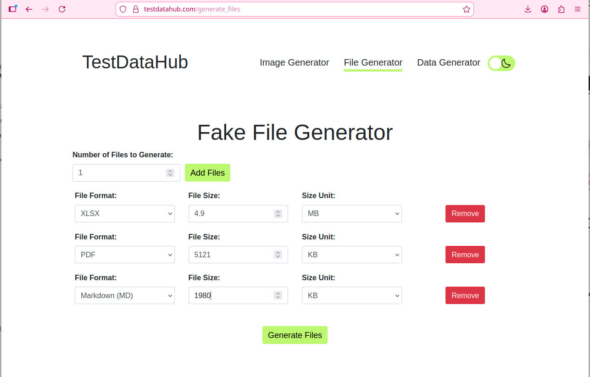
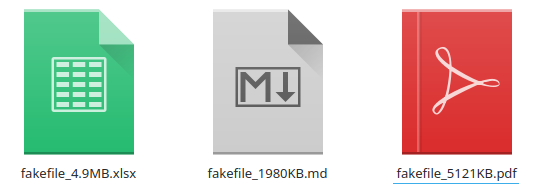

# Тестовые данные

В данном документе представлены ресурсы для генерации данных, результаты тестирования формы загрузки аватара и список сгенерированных пользователей для тестирования локализации.

---

## 1. Ресурсы для генерации файлов (размер/тип)

Эти инструменты позволяют создавать файлы любого расширения и точного веса (КБ, МБ, ГБ) для проверки лимитов загрузки.
1. [**TestDataHub**](https://testdatahub.com/generate_files) — максимально простой интерфейс: выбираете количество, формат, размер, расширение и скачиваете готовый файл.
2. [**Online Test File Generator**](https://pinetools.com/random-file-generator) — позволяет генерировать не только пустые файлы, но и файлы с реальным содержимым заданного веса.

## 2. Ресурсы для генерации персональных данных

Инструменты для создания реалистичных профилей пользователей (ФИО, адреса, телефоны).
1. [**Mockaroo**](https://www.mockaroo.com/) — мощный инструмент для генерации структурированных данных (CSV, JSON, SQL). Можно настроить формат для любой страны.
2. [**Random User Generator**](https://randomuser.me/) — отличный API и веб-интерфейс для получения случайных профилей с фотографиями.

---

## 3. Тестирование лимита загрузки аватара (до 5 МБ)

Для проверки лимита в 5 МБ (5120 КБ) я подготовил три файла с помощью ресурса **FileGen**.

### Сценарии:
* **Тест 1 (Позитивный):** Файл 1 МБ. Проверка базовой загрузки.
* **Тест 2 (Позитивный, граничное значение):** Файл 4.9 МБ. Проверка загрузки максимально допустимого веса.
* **Тест 3 (Негативный):** Файл 5.1 МБ. Проверка работы валидатора (ожидается ошибка "Файл слишком большой").

### Подтверждение размеров файлов (имитация свойств системы):

| Имя файла | Тип | Размер | Результат ожидания |
| :--- | :--- | :--- | :--- |
| `fakefile_1980KB.md` | Markdown | 1980Kb | Загружен успешно |
| `fakefile_4.9MB.xlsx` | xlsx | 4.9Mb | Загружен успешно |
| `fakefile_5121KB` | pdf | 5121Kb | **Ошибка валидации** |

> **Скриншот свойств файлов:**

---

## 4. Генерация тестовых пользователей (Австралия 🇦🇺)

Данные сгенерированы с учетом стандартов Австралии.

| ФИО | Телефон | Email | Адрес |
| :--- | :--- | :--- | :--- |
| **Lucas Miller** | +61 491 570 110 | lucas.miller@example.au | 22 O'Connell St, Sydney NSW 2000 |
| **Isla Williams** | +61 411 000 892 | isla.w@webmail.com.au | 158 Lonsdale St, Melbourne VIC 3000 |
| **Oliver Smith** | +61 8 9221 1555 | o.smith@domain.au | 12 St Georges Terrace, Perth WA 6000 |
| **Mia Brown** | +61 7 3006 1234 | mia.brown@provider.au | 100 Creek St, Brisbane QLD 4000 |
| **Ethan Jones** | +61 422 999 333 | ejones@test.com.au | 45 Pirie St, Adelaide SA 5000 |

### Проверка форматов:
* **Телефоны:** В Австралии мобильные номера начинаются с `04` или `+61 4` (всего 10 цифр). Городские номера имеют код штата (например, `08` для WA или `02` для NSW). Все сгенерированные номера соответствуют этим правилам.
* **Адреса:** Формат соответствует стандарту: `Номер дома + Улица, Пригород (Suburb) + Код штата (NSW/VIC/QLD) + 4-значный индекс`. Индексы 2000 (Сидней) и 3000 (Мельбурн) являются валидными.
* **Email:** Использованы национальные домены `.com.au` и `.au`, что типично для региона.
