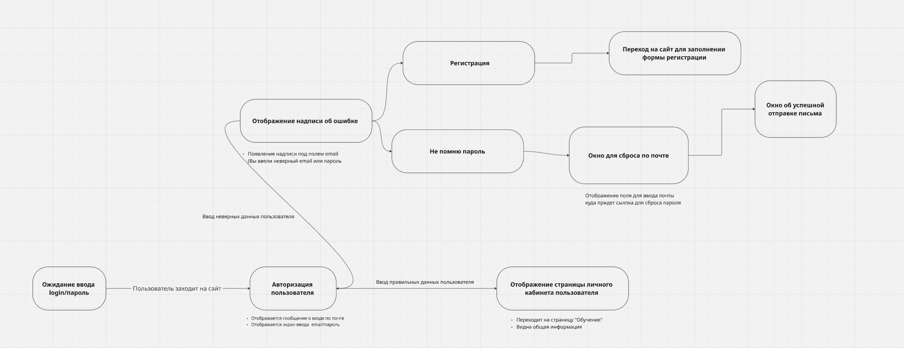

# Таблица и диаграмма переходов и состояний

**Объект:** Страница авторизации «Школа 21» — [applicant.21-school.ru/auth](https://applicant.21-school.ru/auth)

---

## 1. Диаграмма переходов (State Transition Diagram)

Здесь наглядно показано, как пользователь перемещается между экранами в зависимости от своих действий.

